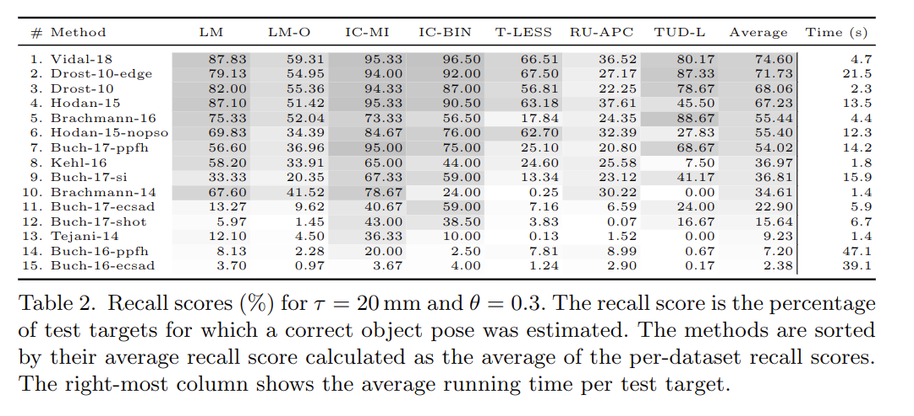

# patch linemod

## prerequisite

### pysixd

files: params/  pysixd/  t_less_toolkit/  tools/  
copied from [sixd_toolkit](https://github.com/thodan/sixd_toolkit)  
deal with model reading/rendering, datasets reading and evaluation  

### dataset

get dataset under top level folder folder using following cmd  
```
wget -r -np -nH --cut-dirs=1 -R index.html http://ptak.felk.cvut.cz/6DB/public/
```

### library

install opencv3 with contrib rgbd module  
install pybind11  
install open3d(for icp)

pip3 install -r requirements.txt

### steps

in target folder:  
mkdir build  
cd build/  
cmake ..  
make  

in top level folder, if use pybind:  
pip3 install target_folder/  

python3 patch_linemod_test.py

### how to evaluate

patch_linemod_test.py, 57-66, select dataset & mode, train & test  
tools/eval_calc_errors.py, 19-27, select dataset, run  
tools/eval_loc.py, 180-186, select dataset, run  
Results are saved to top_level_folder/eval  

### current results

| dataset           | score      |
| ----------------- | :--------- |
| linemod           | 0.84833333 |
| linemod occlusion | 0.56717325 |
| tejani            | 0.98666667 |
| doumanoglou       | 0.93000000 |
| tless             | 0.56176800 |
| rutgers           | 0.29055516 |
| tudlight          | 0.58000000 |
| Average           | 0.68064200 |
### BOP: Benchmark for 6D Object Pose Estimation
  

[Chinese blog](https://zhuanlan.zhihu.com/p/45538349)
